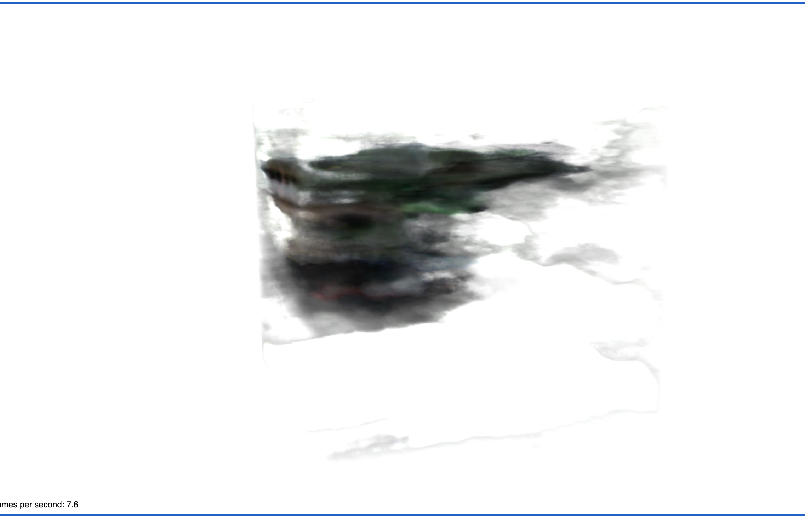
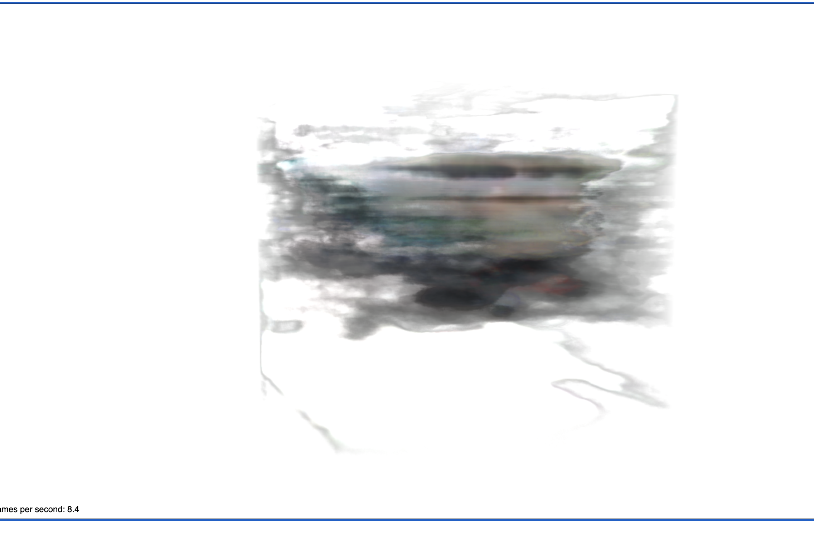
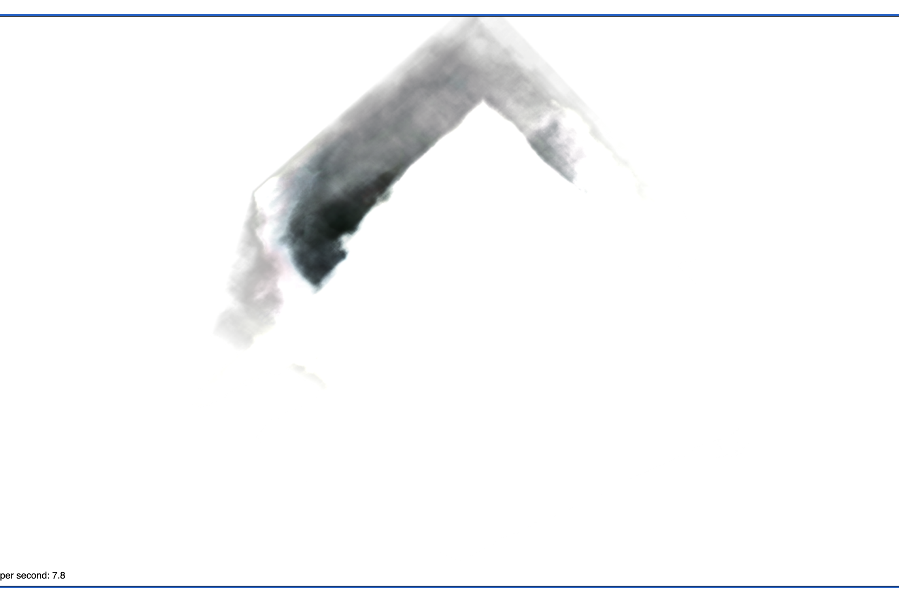

# The Engine Model, Trial Three

# Config File in Training
1. File_name: `configs/demo.yaml`
2. Modifications:
    a. `voxel_resolution: 800`
    b. `snerg_dtype: float16`
    c. `batch_size: 256`
3. Num_iterations: 50,000
4. Did the model converge? 
    a. yes for the most part - over the course of the epochs the `avg_loss` decreased from about 0.045 to 0.014.

# The Dataset
- 100 training, 100 val, 200 testing
- depth maps were much more defined (normalized to be 0-1)
- camera was closer to the engine
- **I left only 1 light in the Blender scene**
- Data dir name: `engine_closeup_normalized_1light`

# Results
1. Qualitative: the overall shape was non-existent, some color showed
2. PSNR: 10.53106867654687
3. Checkpoint dir: `snerg_on_engine_1light.zip` - AWS
4. Baked images: `baked_1light`

## Visual Look

*Figure 1*: This is roughly the front of the cube, looking down.

*Figure 2*: This is roughly the side view of the cube.

*Figure 3*: This is roughly the bottom view of the cube, looking up.

Summary: from the pictures above, we can see the rendered models has the faint outlines of a cube-like shape. The green color and blue comes out in some areas, but not all.

# Performance

| Metric               |  `Mesh` |
|----------------------|--------|
| **Avg. FPS (over 60 s, rounded to the nearest 0.01)**|   8.68   |
| **# of Triangles in Mesh** | 2 |
| **# of Draw Calls** |  1 |
| Size of Assets (MB)     |  82.5    |
| GPU Memory Footprint (rounded to nearest 10 MB)         |   1.4 GB    |

