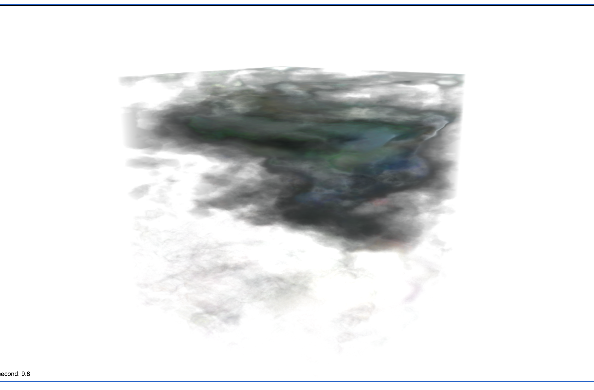
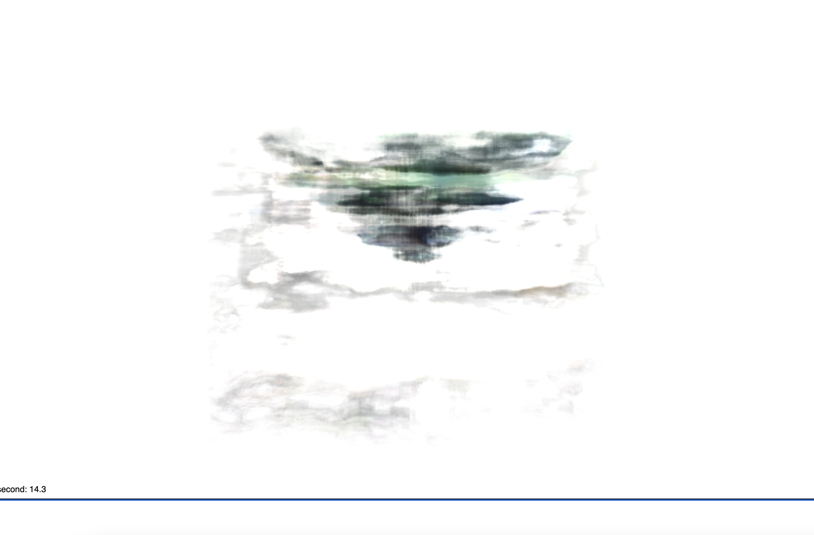
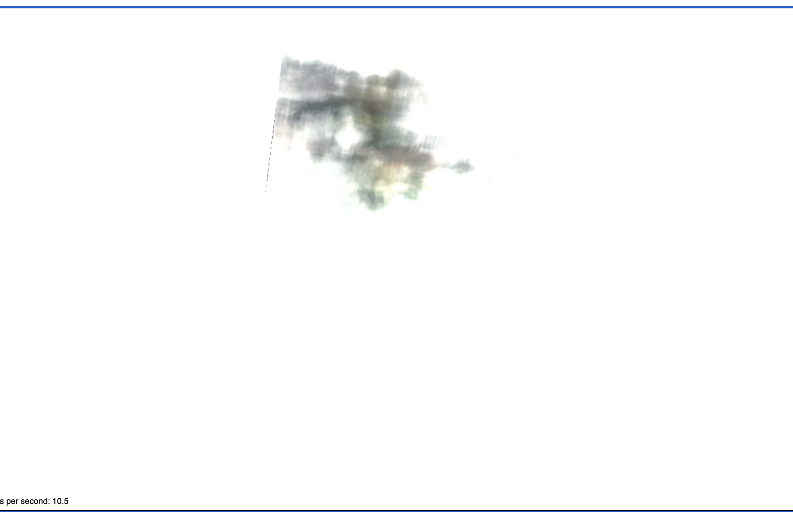

# The Engine Model, Trial Two

# Config File in Training
1. File_name: `configs/demo.yaml`
2. Modifications:
    a. `voxel_resolution: 800`
    b. `snerg_dtype: float16`
    c. `batch_size: 256`
3. Num_iterations: 47500
4. Did the model converge? 
    a. pretty much - the `avg_loss` was bouncing around `0.0130`

# The Dataset
- 100 training, 100 val, 200 testing
- **depth maps were much more defined** (normalized to be 0-1)
- **camera was closer** to the engine
- I **added 4 lights around** the model in the scene, placed on both sides of the model along the X and Y axes
- Data dir name: `engine_closeup_with_normalize`

# Results
1. Qualitative: the overall shape was non-existent, some color showed
2. **PSNR**: 10.516991861087531
3. Checkpoint dir: `snerg_engine_depth.zip` - AWS
4. Baked images: `baked_engine2_depth.zip`

## Visual Look

*Figure 1*: This is roughly the front of the cube, looking down.

*Figure 2*: This is roughly the side view of the cube.

*Figure 3*: This is roughly the bottom view of the cube, looking up.

Summary: from the pictures above, we can see the rendered models has the faint outlines of a cube-like shape. The green color and blue comes out in some areas, but not all. To me it is not clear whether 4 lights in this scene is having much of an effect - as compared to Trials 3 and 4, this rendered models still has large patches of whiteness. On the other hand, it does seem have blackened a lot less, than in the experiments where there's only 1 light.
# Performance

| Metric               |  `Mesh` |
|----------------------|--------|
| **Avg. FPS (over 60 s, rounded to the nearest 0.01)**|   6.08   |
| **# of Triangles in Mesh** | 2 |
| **# of Draw Calls** |  1 |
| Size of Assets (MB)     | 79.2 |
| GPU Memory Footprint         | 1.4 GB |

