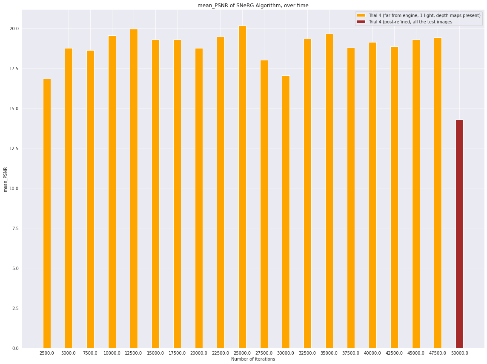

# Trials Compared

## Data Characteristics

Table 1 looks at the differences in the synthetic datasets that SNeRG trained on, across each trial.
All of these datasets were for one of our engine GLB models.

*Table 1:* Dataset Characteristics

| **Trial**               |  **Final PSNR** (rounded) | **Depth maps present?** | **Camera distance?** |  **No. of lights**  | **Accurate Shape?** |  **Total Num of Training Iterations**
|-------------------------|-----------------|-------------------------|----------------------|---------------------|--------------|-------|
|   1       |    28.72   |   no | far  | 1  | well-defined  | 5,000
|   2       |    10.51   |   yes | close  | 4  | undefined (cube-like)  | 47,500
|   3       |    10.53   |   yes | close  | 1  | undefined (cube-like)   | 50,000
|   4       |    14.30   |   yes | far | 1  | undefined (cube-like)   | 50,000
|   5       |    29.52   |   yes | far  | 1  | well-defined  | 12,500

## Progress Report, March 24, 2022

### Takeaways

- This table suggests that the model performed worse in Trial 1 than Trial 5, as the datasets were both "far" (so they should be comparable). Yet on the former, the model only had a PSNR of only 28.72, while it did 29.52 on the latter. This suggests we might need to look at training hyperparameters, like number of iterations.
- In every case when the depth maps were present, the final output seemed to have color (albeit in Trial 5, it was much less). This suggests *having good depth maps is key to seeing some color* in the final render.
- In 2/3 trials where the camera was "far", the final render had a well-defined shape. However, in 2/2 trials where the camera was "close", the shape was undefined. This suggests *having the camera farther away is better for getting an accurate shape*. But further detail is needed here, because in Trial 4 the camera was farther away, but the shape was still undefined.

### Questions Remaining

1. **Algorithm-centric:** how does the PSNR of SNeRG change over the course of training checkpoints?

    1. Is this trend similar or different, if we looked at it on a "*close*" vs. "*far*" dataset?
        1. *Note*: at this time I'm more concerned about the far datasets. We could see from Trial 1 and 5, increasing the number of iterations from 5,000 to 12,500 increased the PSNR from about 28 to 29. But, going all the way to 50,000 iterations (like in Trial 4), and the PSNR nearly halved to about 14.

    2. *To test*: we could use the `eval.py` script, and run it on both the checkpoints/datasets for Trial 4 (would need to make sure `eval_once = False` in the config.)

    3. *Results*: see below
    
    

    Initial conclusions: 
    1. *caveat*: thanks to a bug in our code, I haven't yet been able to compute the mean_PSNR exactly as I wanted to for all of Trial 4's checkpoints (I colored the last bar in the plot above to show where it's different) - BUT, I do think the bars that we have are similar enough to use for comparison (the mean_PSNR for the first 19 checkpoints was computed over just 10 test images, while the last was over all 100).
    2. similar to the table above, the PSNR values in this plot do seem to increase, then fall. At checkpoint 5,000 the mean_PSNR in this graph is about 19 - by checkpoint 12,500 it is has then risen to approx. 20. However, by checkpoint 50,000 it is much lower.
    3. on the other hand, the mean_PSNR values in the bar chart are noticeably lower than those found in the Table above, (when we look at the checkpoints for 5,000 and 12,500, and compare them to the PSNR's in Trial 1 and 5 respectively). This might be a big deal, as an explanation could just be that the extra refining steps that are done in the `bake.py` (and not in our `eval` script) help increase the mean_PSNR by a little more. 
    4. finally, the mean_PSNR seems to peak at checkpoint 25,000. This is the only bar that clearly rises above 20, thus **suggesting 25,000 could be the best number of iterations to train SNeRG for** (with a dataset that's comparable to Trial 4's data).

 

2. **Data-centric:** What is the relationship between the camera distance from the model (when generating the dataset), and the quality of the eventual model (particularly in terms of the shape)?

    1. *To test*: if we really can't seem to get things to work through hyperparameter tuning (and we haven't yet), THEN once we know the right number of iterations to have (from answering #1), we could go ahead and generate 3 new datasets. We would measure the exact distance the camera is in each, to ensure one is "close", "far", and also maybe have 1 that's "middle". Finally, we could train SNeRG on all of them, to the right number of iterations, and compare how well the shape comes out (in terms of both PSNR, and SSIM).

