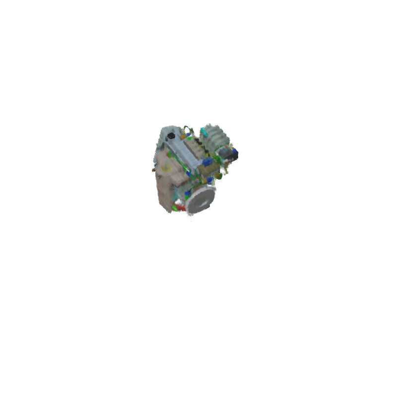

# The Engine Model, Trial Eight

## Config File in Training
1. File_name: `configs/trial8.yaml`
2. Modifications: mainly, added more memory and params to the model (i.e. doubled both `snerg_dtype` and `net_width`)
3. Num_iterations: 65,000 in total
4. Did the model converge? almost
    1. graph of the `train_avg_loss` on the [visualization site](https://tensorboard.dev/experiment/aN0aW5mNS26nWTkMiowX9g/#scalars) was still decreasing when the training stopped, which indicates the model was still moving towards the minima. 

## The Dataset - same as Trial 6
- 100 training, 100 val, 200 testing
- depth maps were present 
- **camera was farther away** from the engine
- **"Solid"** rendering was used, rather than "Material Preview"
- Data dir name: `engine_6_ds`

## Results
1. TensorBoard visualizations: [TensorBoard.dev link](https://tensorboard.dev/experiment/aN0aW5mNS26nWTkMiowX9g/#scalars)
2. **Highest Test PSNR**: 34.58 (at step 58,800).
3. Checkpoint dir: `snerg_on_engine_8` - AWS EC 2
4. Baked images: N/A

## Visual Look

*Figure 1*: 

The two images below were taken at the 57,600th training step (the test PSNR was about 32.14). As we can see, the model's prediction (on the top) is doing incrementally better, but still missing the finer details in the ground truth (on the bottom), such as the small green wires on the engine.

## Performance 

| Metric               |  `Mesh` |
|----------------------|--------|
| **Avg. FPS (over 60 s, rounded to the nearest 0.01)**| TODO  |
| **# of Triangles in Mesh** | TODO |
| **# of Draw Calls** | TODO |
| Size of Assets (MB)     | TODO   |
| GPU Memory Footprint (rounded to nearest 10 MB) |   TODO    |

## Takeaways and Remaining Work

1. One of the takeaways I have is looking at the `test_psnr` graph, we can speed the model somewhat sporadically rises and falls (even though the overall trend is up into the right). This needs more investigating to truly understand (perhaps we tune to tweak the optimizer?). In the meantime, in future runs it might be good to save checkpoints more frequently.

2. On a similar note, we can see from the `train_avg_loss` graph that the model's loss briefly diverges around step 21.4K. It is unclear why, because this didn't happen in previous runs I can remember, and at the time the learning rate was decreasing. This could be another reason to tweak the optimizer, which is currently uses the `flax` implementation of [Adma](https://flax.readthedocs.io/en/latest/_autosummary/flax.optim.Adam.html#flax.optim.Adam).

3. Finally, it does seem that adding more iterations and doubling `net_width` improved the model.