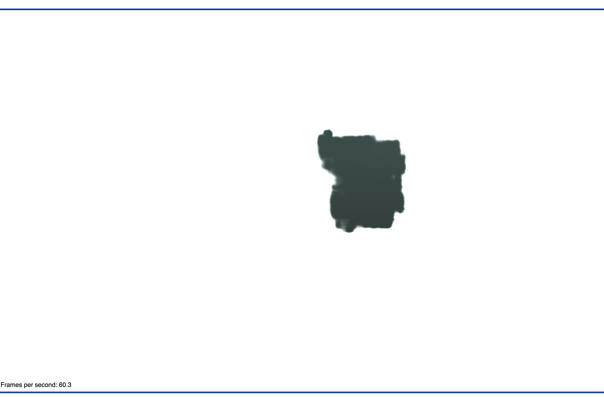
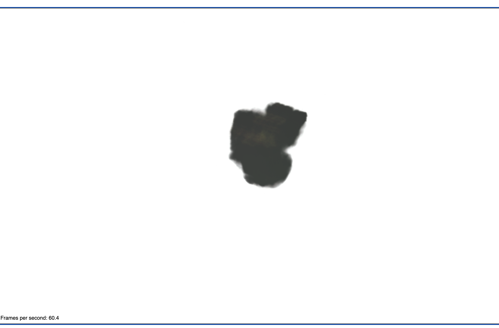

# The Engine Model, Trial Five

# Config File in Training
1. File_name: `configs/demo.yaml`
2. Modifications:
    a. `voxel_resolution: 800`
    b. `snerg_dtype: float16`
    c. `batch_size: 256`
3. Num_iterations: 12500
4. Did the model converge? 
    a. ??? - unfortunately I lost the logs saying the model loss

# The Dataset
- 100 training, 100 val, 200 testing
- depth maps were basically invisible
- **camera was farther away** from the engine
- Data dir name: `engine_5_ds`

# Results
1. Qualitative: shape is well defined, only *slightly* more color than Trial 1 (see below).
2. **PSNR**: 29.517992679737848
3. Checkpoint dir: `snerg_on_engine_5` - AWS EC 2
4. Baked images: `baked_5`
## Visual Look

*Figure 1*: it is hard to tell, but from this viewing angle the rendered engine appears to be slightly tinted green. This suggests that adding the depth maps did slighly help in adding color to the model (as compared with Trial 1, in which there were no depth maps and the engine was black all over).

*Figure 2*: as we can see, most of the rendered engine is solid black.

# Performance

| Metric               |  `Mesh` |
|----------------------|--------|
| **Avg. FPS (over 60 s, rounded to the nearest 0.01)**|   59.50   |
| **# of Triangles in Mesh** | 2 |
| **# of Draw Calls** |  1 |
| Size of Assets (MB)     | 7.7       |
| GPU Memory Footprint (rounded to nearest 10 MB) |   770    |

