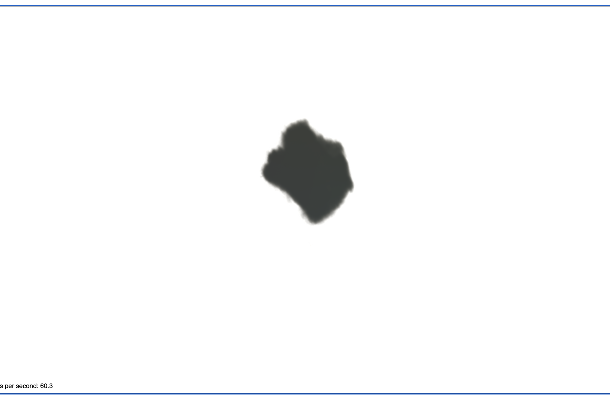
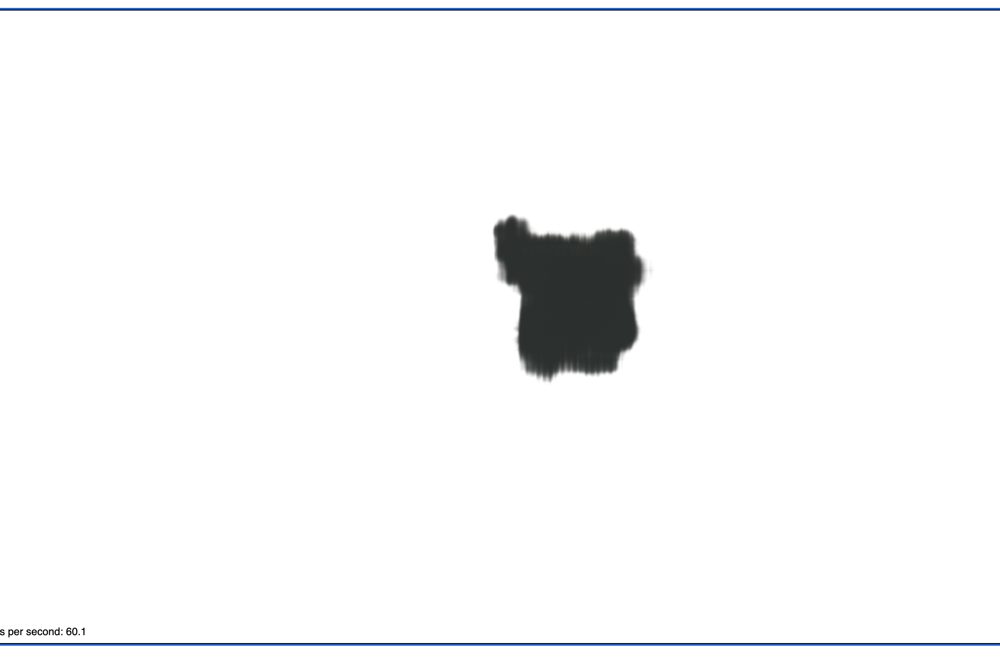

# The Engine Model, Trial One

# Config File in Training
1. File_name: `configs/demo.yaml`
2. Modifications:
    a. `voxel_resolution: 800`
    b. `snerg_dtype: float16`
    c. `batch_size: 256`
3. Num_iterations: 5000
4. Did the model converge? 
    a. no, but it steadily decreased throughout training

# The Dataset
- 100 training, 100 val, 200 testing
- depth maps were basically invisible
- **camera was farther away** from the engine
- Data dir name: `engine_small_ds`

# Results
1. Qualitative: the overall shape was there, but no color
2. **PSNR**: 28.722675616322434
3. Checkpoint dir: `snerg_on_engine` - AWS
4. Baked images: `baked_engine1`

## Visual Look

*Figure 1*: This is roughly the top, looking down at the model:

*Figure 2*: This is roughly the side:

*Figure 3*: This is another side view:

Summary: As we can see from the images above, the model has a shape that's fairly close to that of the input. However there are some serious defects such as the lack of color, and the fuzzy edges.

# Performance

| Metric               |  `Mesh` |
|----------------------|--------|
| **Avg. FPS (over 60 s, rounded to the nearest 0.01)**|   59.05   |
| **# of Triangles in Mesh** | 2 |
| **# of Draw Calls** |  1 |
| Size of Assets (MB)     | 2.2       |
| GPU Memory Footprint (rounded to nearest 10 MB)         |   790    |

