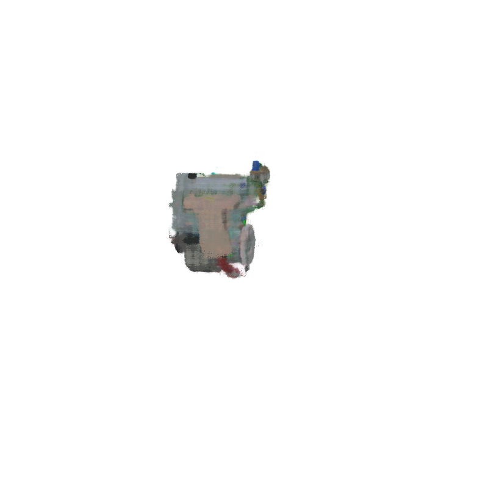
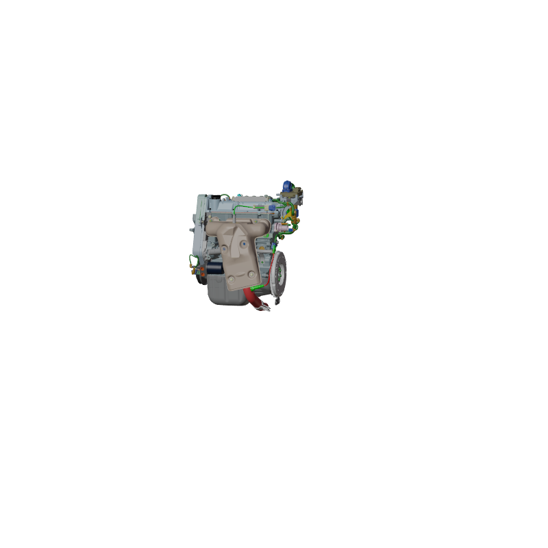

# The Engine Model, Trial Seven

# Config File in Training
1. File_name: `configs/trial7.yaml`
2. Modifications: mainly, increased the `voxel_resolution` to 1,000, and raised `max_steps` to 1,000,000
3. Num_iterations: 46,800
4. Did the model converge? no
    1. From the [visualization site](https://tensorboard.dev/experiment/Xvd1EzikRpeG5Ek8ydCbUA/), we can see that the `train_avg_loss` and was still steadily decreasing at the end of the 46.8K iterations. Even though the plots for the `test_PSNR` and `test_SSIM` shows that peak performance was around the point of 27.6K iterations, we can still see that they were on an upward trajectory when the training stopped.
    2. "Was the model overfitting?" is another question to consider here. I would say yes (to a small extent) - as we can see from the `train_avg_PSNR` plot for example, we can see it's final value was about 32, while that of the `test_PSNR` was only about 31.

# The Dataset - same as Trial 6
- 100 training, 100 val, 200 testing
- depth maps were present 
- **camera was farther away** from the engine
- **"Solid"** rendering was used, rather than "Material Preview"
- Data dir name: `engine_6_ds`

# Results
1. TensorBoard visualizations: [TensorBoard.dev link](https://tensorboard.dev/experiment/Xvd1EzikRpeG5Ek8ydCbUA/)
2. **PSNR**: 31.95
3. Checkpoint dir: `snerg_on_engine_7` - AWS EC 2
4. Baked images: `baked_7`

## Visual Look

*Figure 1*: Below I have pasted one of the predictions that the model made on its last step, along with the corresponding ground truth image. Although we can see the model is inching towards accurate colors and well-defined shapes (which makes sense, because it's the highest PSNR ever), we can see that the prediction is still missing some of the finer details. E.g. the model is not yet quite able to distinctly render all holes and wires on the front of the engine.

# Performance 
Going to SKIP for now - these come out essentially the same each trial, because there aren't that many changes happening in the algorithm/ground truth data. 

| Metric               |  `Mesh` |
|----------------------|--------|
| **Avg. FPS (over 60 s, rounded to the nearest 0.01)**| TODO  |
| **# of Triangles in Mesh** | TODO |
| **# of Draw Calls** | TODO |
| Size of Assets (MB)     | TODO   |
| GPU Memory Footprint (rounded to nearest 10 MB) |   TODO    |

