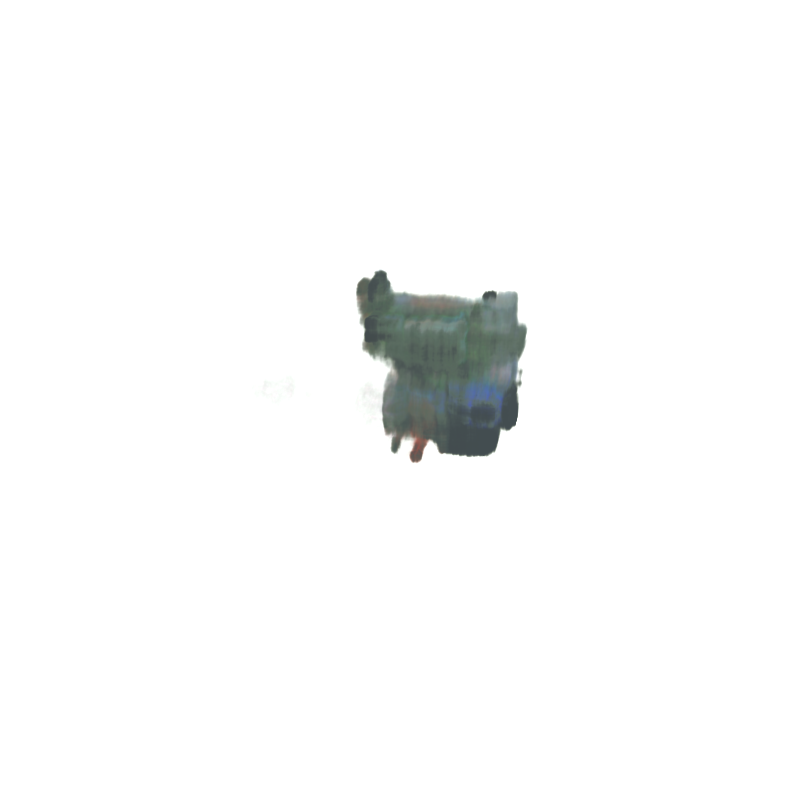

# The Engine Model, Trial Six

# Config File in Training
1. File_name: `configs/trial6.yaml`
2. Modifications:
3. Num_iterations: 25,000
4. Did the model converge? 
    1. not sure, I lost the logs with training loss (can run again later though if needed)

# The Dataset
- 100 training, 100 val, 200 testing
- depth maps were present 
- **camera was farther away** from the engine
- **"Solid"** rendering was used, rather than "Material Preview"
- Data dir name: `engine_6_ds`

# Results
1. Qualitative: **much** better color and shape. But clearly still has room for improvements
2. **PSNR**: 30.98239054793492
3. Checkpoint dir: `snerg_on_engine_6` - AWS EC 2
4. Baked images: `baked_6`

## Visual Look

*Figure 1*: as we can see from the following views of the front, side, and back, this render has a definite shape *and* is almost starting to show distinct regions of color. Nonetheless, the images are still too pixelated to be photorealistic. The colors are also very dull (but this might just be due to the fact that we switched to using the "Workbench" rendering engine in our data collection, as per the project requirements).

# Performance

| Metric               |  `Mesh` |
|----------------------|--------|
| **Avg. FPS (over 60 s, rounded to the nearest 0.01)**|   52.29   |
| **# of Triangles in Mesh** | 2 |
| **# of Draw Calls** | 1 |
| Size of Assets (MB)     | 5.6      |
| GPU Memory Footprint (rounded to nearest 10 MB) |   770    |

